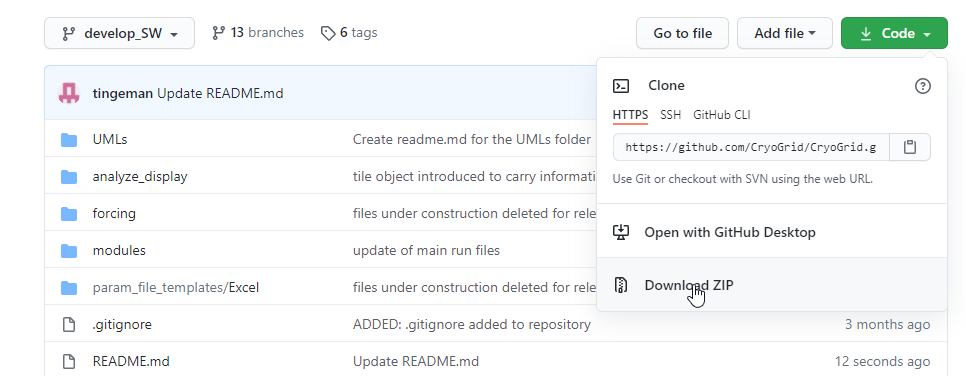

# CryoGrid
This is the modular version of CryoGrid which is based on an object-oriented programming paradigm.

## Get started as a user


### Get the main CryoGrid code

Download the CryoGrid code as zip-file. From the main GitHub repository page, click the green `code` button and choose `Download Zip`. See screenshot below.



Now unzip the code to your preferred folder, f.ex. `c:\my_matlab_code\cryogrid\`.

### Get the test example

Download zip-file containing the test model setup files from the following link: [Link to example code](https://nextcloud.awi.de/s/wiHWsrrxXtszH4m
).

Create a new folder `results` in your cryogrid folder (`c:\my_matlab_code\cryogrid\results`) and unzip the contents of the zip-file here.

### Run the test model 

Open MatLab and change the path to `c:\my_matlab_code\cryogrid\develop_SW\`. This can be done either using the MatLab path selector dialog, or by typing in the command window:

`cd c:\my_matlab_code\cryogrid\develop_SW\`

Change the paths according to your actual install directory.

To run the example model, in the MatLab terminal run the file run_CG.m file by typing:

`run_CG`

The code will start running. It will produce one ouput file per year, which is written to the disc at a specific date (defined in the parameter Excel file `c:\my_matlab_code\cryogrid\results\test\test.xlsx`). You can stop the code any time after a full year has been calculated (to ensure you have an output file written to disc).

The first output file written to disc will have the name `c:\my_matlab_code\cryogrid\results\test\test_19800901.mat`.

To plot the results, change the path to `c:\my_matlab_code\cryogrid\develp_SW\analyze_display\`:

```
cd c:\my_matlab_code\cryogrid\develp_SW\analyze_display\
load(`c:\my_matlab_code\cryogrid\results\test\test_19800901.mat`)
read_display_out()
```

### To change the model parameters

The model is defined in the file `c:\my_matlab_code\cryogrid\results\test\test.xlsx`.
You may play around with the model parameters and se how the output changes.

For example, you could change the thickness of layer 1:

- Open the excel file
- Find the section `STRAT_layers`
- First column is the depth to the bottom of the layers ( so row 1 has the depth to the bottom of layer 1)
- The first layer is by default from 0 - 0.5 m (o.5 m thick).
- To change the thickness of the first layer to 1 m, simply change the value from 0.5 to 1.

Rerun the model to see the changes. (Be aware that the out files are overwritten, back them up if you want to store for comparison.)

### Full documentation

There is a pdf file available with more in depth explanation of the model 


# BELOW HERE NOT YET UPDATED


### From the command line

First clone the code with 
```
cd [folder of choice]

# if you have github setup with SSH
git clone git@github.com:CryoGrid/CryoGrid.git

# or if you are not setup with SSH
git clone https://github.com/CryoGrid/CryoGrid.git
```
Github has a [Desktop GUI]() software that can be used to clone the repository.

## Get started as a developer


## Documentation

### Participate to the documentation
The documentation is written in markup language reStructuredText `.rst` or [Markdown](https://www.markdownguide.org/basic-syntax/)(`.md`). rST is the preferred markup language, but both are supported as argued in [this blog post](https://www.ericholscher.com/blog/2016/mar/15/dont-use-markdown-for-technical-docs/).

You can directly edit a page on our [GitHub]() documentation repository, or you can clone the repository, modify it, verify it builds locally, and finally push it back to GitHub.

Creating a new page is as easy as 

### Steps to create documentation from scratch
1. install [Miniconda](https://docs.conda.io/en/latest/miniconda.html)`
2. Then in your terminal (assuming you're on Linux or MacOS)
```shell
# creates a virtual environment
conda create -n docu_env

# Activate the virtual environment
conda activate docu_env

# install pip. Pip is a Python package installer
conda install pip

# install Sphinx which is the engine building the html documentation from the .rst or .md files
pip install sphinx`

# Go to Path
cd /path/to/project
mkdir docs
cd docs

# Build original documentation
sphinx-quickstart
```
From now you can open the documentation build locally with the file `_build/html/index.html`

3. To setup your documentation for markdown, and also use the ReadTheDoc template install
```shell
pip install sphinx-rtd-theme
pip install recommonmark
```

Then in the file `config.py` insert the following
```python
extensions = ['recommonmark', 
				'sphinx_rtd_theme'
]

# and replace
#html_theme = 'alabaster'
html_theme = "sphinx_rtd_theme"
```
4. finally you can build the new version of the documentation with
```shell
make html
```
Open the file `_build/html/index.htm` with your browser.

5. Push the project to the github documentation
6. Create a new page
```shell
# create a directory called source that will contain all files
mkdir source
nano source/intro.md
```
Indicate **Sphinx** to seek for this new file by adding in the file `index.rst`:
```rst

.. toctree::
   :maxdepth: 3
   :caption: Contents:

   source/intro
   source/ add here you next content. One file per page. 
```


