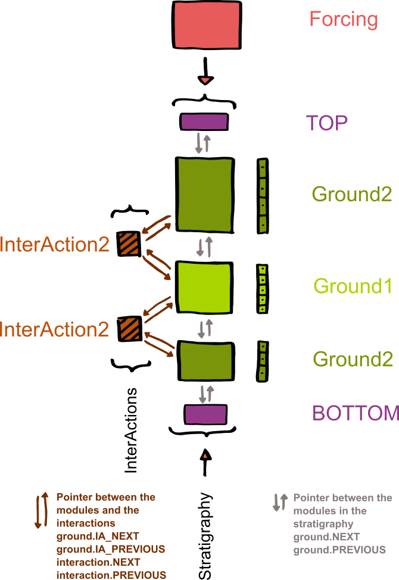
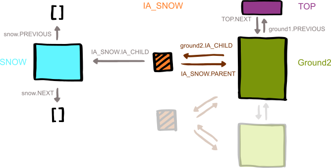
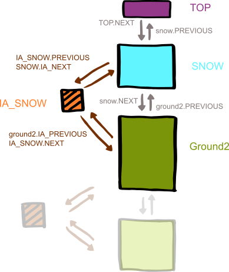

Cryogrid
============

This Documentation
-------------------
1. How to Set Up a New Model Run
1. Structure of the Model and Terminology
2. Style Guide
3. How to Write a New Forcing  
4. How to Write a New Interaction  
5. How to Write a New Module
6. (How to Write a New Trigger)

How to Set Up a New Model Run
-------------------------------------

1. Create a new folder *yourRunningNumber* in the results folder
1. Create (or copy) the files *CONSTANT_excel.xlsx* and *yourRunningNumber.xlsx* in that folder
1. Check if all *constants* you need are set up in *CONSTANT_excel.xlsx*
1. Set up your stratigraphy in *yourRunningNumber.xlsx*
1. Set up all necceassary *parameters* and *state variables* for the classes that you are using in *yourRunningNumber.xlsx*
2. Change the runningNumber in *main.m* to *yourRunningNumber*
6. Run main program *main.m*

**Terminology**

+ *class*: Matlab class (https://se.mathworks.com/help/matlab/object-oriented-programming.html), realizes object-oriented programming in Matlab
+ *CryoGrid class*: Matlab class with mandatory functions and properties which contains the defining equations for the time evolution of the ground, snow, etc. Note that many of the classes in the code are not CryoGrid classes, but do something else! A *module* is a realization of the class.
+ *parameter file*: spreadsheet (in Excel at this point) used to set up a CryoGrid run
+ *CryoGrid stratigraphy*: stratigraphy of connected CryoGrid classes

**Folder structure**

- *main.m*: main file to be executed
- *read_display_out.m*: displays the modulke *out* produced by the OUT class *OUT_all.m*. All CryoGrid classes stored in *out* must be initialized before this function works. You can also implement your own OUT class.
- **results**: contains the parameter file and the output files in a folder corresponding to the variable *run_number* in *main.m*
- **forcing**: contains the forcing data as *.mat*-files. If you use the FORCING class, the files must have the same structure as in the sample file provided.
- **modules**: contains the model code
- **modules/@CLASS_NAME**: code of individual CryoGrid classes
- **modules/INTERACTION**: code of interaction classes, which define interactions between two model classes
- **modules/FORCING**: code of FORCING classes which make forcing data accessible for the CryoGrid classes
- **modules/IO**: contains all code related to in/out user interactions (e.g. initialization), not relevant for the time integration in the CryoGrid classes
- **modules/IO/GRID**: GRID classes which provide options for different model grids (at this stage only one!), only used to interface with the user
- **modules/IO/STRATIGRAPHY**: STRATIGRAPY classes which provide options to provide initial stratigraphies for the different model variables, only used to interface with the user. Three options, STRAT_layers (layers with constant properties), STRAT_linear (linear interpolation between given points) and STRAT_classes (defines the stratigraphy of CryoGrid classes)
- **modules/IO/OUT**: OUT classes which store model output (only one option at this stage)
- **modules/IO/INITIALIZE_PARAMETER_FILE**: contains the Matlab code (functions, not classes) to read the parameter file and initialize the CryoGrid stratigraphy.
- **modules/COMMON**: contains functions that could be used by classes at all levels in the class hierarchy

**Inheritance**

Stacking of different modules to form a stratigraphy is organised with pointers to the NEXT and PREVIOUS module, and special TOP and BOTTOM modules to indicate the current top and bottom positions. The same method is used for interactions.

Therefore every class (interactions, ground, snow...) need to be subclasses of *matlab.mixin.Copyable*. For the ground and snow classes, we recommend to use *GROUND_base_class* and *SNOW_base_class* as superclasses. This also guarantees the existence of (fallback) mandatory functions and variables.

We recommend to use a hierarchy of inhertance to introduce new functionalities, where on each level only one new functionality is implemented. The first level is the base class. The classes on level three and above should reference the superclasses in their name to make it obvious which class inherits fromwhere.
For the ground class with surface energy balance as boundary condition and energy as state variable the inheritance hierarchy could be

        GROUND_base_class < GROUND_seb < GROUND_seb_snow

**Basic Structure of the Soil Column**

A model run needs a forcing module, the special TOP and BOTTOM modules and one (or more) ground/snow/... modules to build the stratigraphy of the 1D (soil-) column that is being modelled. The stacked ground (or snow) modules are linked with pointers *ground.NEXT* and *ground.*PREVIOUS*. Interaction (e.g. exchange of heat, salt, water) between modules happens with interaction classes. Again the connection is realised with pointers *ground.IA_NEXT* and *ground.IA_PREVIOUS* from the ground modules to the interaction and *interaction.NEXT* and *interaction.PREVIOUS* from the interaction to the ground modules. In this way the interaction has direct access to both involved ground modules.

A Module can delete itself, move itself to a new position, or initialize and insert a new module (from the same or different classes). This can be used for snow buildup and melt, sedimentation, erosion, ice lenses, lakes.... Here is a short example with snow to illustrate the process.

The uppermost ground module builds a child and connects to it with a interaction. The interaction initializes the child with empty pointers. In the next timesteps, the child gets filled up to a certain threshold (e.g. a certain snow water equivalent). Once this threshold is reached, i.e. the amount of snow is enough to justify a new module, the child gets inserted above the parent as the new top module and all pointers get relocated.

**Structure of the Parameter File**

In each class the variables are handled in different types: constants, parameter, state variables and temporal variables.
The constants get defined in *CONSTANT_excel.xlsx* globally for each run. Please use the naming convention detailed below.
The parameter get defined in *yourRunningNumber.xlsx* seperate for each used class.

The parameters need to be filled in as follows:

        CLASS	              index			
        GROUND_yourName	        1			

	    value	                         default	     unit

        other_parameter          value    default       [unit]    description

        density	                300	    350	  [kg/m3]	snow density
        albedo	                 0.8	    0.8	      [-]	surface albedo
        other_parameter          value    default       [unit]    description
        CLASS_END				

The file is scanned to the key words CLASS and than for pre-defined ("allowed") parameter names. Thus only the first three columns are read and the rest can be used for clarification and comments. Empty lines and lines with dashes can be used to devide the parameters.
The index besides the class name allows for different modules based an the same class, e.g. two ground modules with the same functionalities but different albedo.

The same structure is used for parameter setting of the forcing, the grid and the stratigraphy.

Style Guide
--------------
**Compatibility**

All modules can handle whichever state variable they need and use whichever boundary conditions. However, the boundary conditions need to be compatible with the used interaction class(es) and the used forcing. For example, if you have the temperature as a state variable and the interaction between two modules is handled as a heat flow, then your boundary conditions need to convert the forcing data into heat flows at the upper and lower boundaries.

The interaction classes get selected in **/modules/INTERACTION/** *get_IA_class.m* based on the combination of modules. If you write a new class or interaction, please insert your use cases in this function.

**General Remarks**

- Use meaningful names: Use short phrases for clarity rather than abbreviations for shortness.
- Physical properties should be named by their SI symbols.
- In functions, used variables from containers should be saved by their name, i.e. *theta = ground.CONST.theta*
- Variables and functions should be in lower case. Variable word separation may be indicated with camel case, word separation in function names with underscores.
- If you use equations and constants, cite their source in comments.

**Documentation**

Every author is responsible for the documentation of his*her own module. We use doxygen for the documentation of Cryogrid and therefore recommend the following conventions.

To use doxygen within your code write the documentation comments **above** the function/variable that you are explaining and start the line with "%> " (instead of just "% " for normal comments). Not every comment in the code needs to be forwarded to doxygen for the documentation - choose wisely!

**Mandatory Functions and Variables**

*ground.CONST*

Need to be allocated in *provide_CONST.m* for every class, or in the inheriting superclass(es). Need to be specified in *CONSTANT_excel.xlsx*

                    year_sec = 365*24*3600; % s / yr
    Latent heat     L_f = 334*1000*1000;    % J / m^3

    Heat capacity   c_w = 4.2*1000*1000; % J / (K m^3)
                    c_i = 1.9*1000*1000; % J / (K m^3)
                    c_o = 2.5*1000*1000; % J / (K m^3)
                    c_m = 2*1000*1000;   % J / (K m^3)

    Thermal conductivity
      air           k_a = 0.025;       % W / m K  [Hillel(1982)]
      water         k_w = 0.57;        % W / m K  [Hillel(1982)]
      ice           k_i = 2.2;         % W / m K  [Hillel(1982)]
      organic       k_o = 0.25;        % W / m K  [Hillel(1982)]
      mineral       k_m = 3;           % W / m K
      quartz        k_q = 7;           % W / m K

    Stefan-Boltzmann const.
                    sigma = 5.67e-8;

    Universal gas constant
                    R = 8.314459; % J / K mol

    Tortuousity     tau = 1.5;     % 1.5 standard

    Freezing temperature of water                    
                    Tmelt_free_water = 273.15; % K

*ground.PARA*

Need to be allocated in *provide_PARA.m* for every class, or in the inheriting superclass(es). Need to be specified in *yourRunningNumber.xlsx* for every class within the block for that class.

    Default heat flux at lower boundary                
                    heatFlux_lb = 0.05;    % W / m^2
    Albedo          albedo = 0.15;  %
    Emissivity      epsilon = 0.99; %
                    rs = 100;       %
    Measurement height
                    z =2;           % m
    Roughness length                    
                    z0 = 1e-3;      % m
    Maximum time step
                    dt_max = 3600 ; % s    
    Maximum energy change per time step                    
                    dE_max = 0.5e5;      % J / m^3
    Maximum temperature change per time step                    
                    dT_max = 0.5e5;      % K
    Maximum salt concentration change per time step
                    dsaltConc_max        %
    Snow water equivalent per cell
                    swe_per_cell = 0.01;  % m  must be the same as in SNOW class, should be taken from input file
    Sedimentation Rate
                    sedRate               % m / yr
    Soil Type
                    soilType = 1 .* ones(size(grid_cell_size)); %0 - sand, 1 - silt

*ground.STATVAR*    (depends on your choice of state variables)

Need to be allocated in *provide_STATVAR.m* for every class, or in the inheriting superclass(es). Need to be specified in *yourRunningNumber.xlsx* for the stratigraphy and in *finalize_STATVAR.m* for every class.

                    upperPos = grid(1);
                    lowerPos = grid(end);

                    layerThick  % the distances between layer boundaries in m

                    % Should be sufficient to save only upperPos, lowerPos and layerThick
                    % However, if you want to save other info, please use the following
                    midptDepth      % the depths of module layer midpoints in m
                    midptThick      % the distances between layer midpoints in m
                    layerDepth      % the depths of the module layer boundaries in m

    Initial fractional volumes
                    water = 0.4 .* ones(size(grid_cell_size)); %fraction of volume "m^3/m^3"
                    ice = 0 .* ones(size(grid_cell_size)); %fraction of volume
                    organic = 0 .* ones(size(grid_cell_size)); %fraction of volume
                    mineral = 1.1 * 0.6 .* ones(size(grid_cell_size)); %fraction of volume

    Salt diffusivity
                    saltDiff          % m^2 / s
    Bulk thermal conductivity
                    thermCond         % W / m K
    Effective heat capacity
                    c_eff             % J / m^3
    Liquid water content
                    liqWater          % fraction of volume
    Freezing temperature of solution
                    Tmelt             % K

    % Of the following choose your state variables
    Initial temperature
                    T                 % °C
    Initial salinity - salt concentration in liquid water
                    saltConc = 895 .* ones(size(grid_cell_size)); % mol / l [Dimitrenko 2011]
    Initial energy
                    E                 % J
    Initial total ions - salt concentration per layer volume
                    salt              % mol

*ground.TEMP*

To be calculated in the appropriate functions (*get_boundary_condition_***, *get_derivatives_prognostic*, interactions, etc.) - depends on choice of state variables - needed boundary conditions depend also on the chosen interaction

    % Boundary conditions for the chosen state variable(s) -
    Temperature at upper boundary (for updating of thermal properties)
                    T_ub              % °C
    Heat flux at upper boundary
                    heatFlux_ub       % W / m^2
    Heat flux at lower boundary                
                    heatFlux_lb       % W / m^2

    Salt flux at upper boundary
                    saltFlux_ub       %
    Salt flux at lower boundary
                    saltFlux_lb       %

    Temperature divergence
                    divT              %
    Salt concentration divergence
                    divsaltConc       %

*forcing.PARA*

Need to be specified in *yourRunningNumber.xlsx* in the forcing block. Other parameter of the forcing depends on the chosen forcing class.

    Starttime of forcing data
                    startForcing
    Time step of forcing data
                    dtForcing
    Endtime of forcing data
                    endForcing

    % Other depending on your forcing data

*forcing.DATA*

to be calculated in *generateForcing*. All variable are vectors with the same length

    Vector of discrete time steps
                    timeForcing = [startForcing:dtForcing:endForcing]';
    Vector of forcing temperature
                    TForcing
    Vector of forcing salt concentration
                    saltConcForcing

*forcing.TEMP*

to be calculated in *interpolateForcing* - depending on the choice of state variables.
All variables are single values - interpolated for each time step

    Surface temperature at this time point
                    TForcing
    Surface salt concentration at this time point
                    saltConcForcing

*OUT* und *RUN_INFO*

    Save interval   dtSave

How to Write a New Forcing
---------------------------

A new forcing module loads or generates forcing data. The state variables that are provided by the forcing module need to match the ones that are needed by the used ground modules.

    %> here goes the documentation of the focing module
    classdef FORCING
      properties
        DATA    %all data
        TEMP    %at each timestep
        PARA
        STATUS  %forcing data suitable for the modules that are to be run -> can be used
      end

      methods     %mandatory functions

        %> Descitption of the functions, input and output parameters
        function forcing = initalize_from_file(forcing, section)
            %This function initializes the parameter from the section of the excel file to forcing.PARA
        end         

        %> Descitption of the functions, input and output parameters
        function forcing = load_forcing_from_mat(forcing)
            %This function loads/generates the forcing and stores it in forcing.DATA
        end

        %> Descitption of the functions, input and output parameters
        function forcing = interpolate_forcing(t, forcing)
            %This function will be called by ground modules and should return all state variables, that are needed
        end
      end
    end

How to Write a New Interaction Class
-------------------------------------

The interaction classes handle the boundary conditions for all modules in the stratigraphy that share an *inner boundary* with another module. The interaction has pointers to the two interacting modules and can therefore change both modules directly. The interaction needs to match the boundary conditions that are used in the modules. The interaction classes get selected in **/modules/INTERACTION/** *get_IA_class.m* based on the combination of modules. If you write a new class or interaction, please insert your use cases in this function.

    %> Here comes the documentation of your interaction class
    classdef IA_HEAT < matlab.mixin.Copyable

        properties
            PREVIOUS
            NEXT
        end

        methods

        %> Descitption of the functions, input and output parameters
        function get_boundary_condition_m(ia_heat)
            stratigraphy1 = ia_heat.PREVIOUS;
            stratigraphy2 = ia_heat.NEXT;

            %put interaction here
            %it should act as the boundary conditions for both involved section,
            %i.e. get_boundary_condition_l for stratigraphy1 and as get_boundary_condition_u for stratigraphy2
        end
      end
    end

How to Write a New Module
----------------------------
The definition of a new module should look like follows. The functions are mandatory for the time loop to work. The "initialize" function may take additional input parameters, as you only use it before entering the time loop, the other functions may not.

    %> Here comes the documentation of your new module
    classdef GROUND_yourName
      properties
        CONST     %constants
        PARA      %external service parameters, all other
        STATVAR   %state variables - choose wisely
        TEMP      %derivatives in prognostic

        PREVIOUS  %pointer to previous module
        NEXT      %pointer to next module
        IA_PREVIOUS %pointer to interaction with previous module
        IA_NEXT   %pointer to interaction with next module
      end

      methods     %mandatory functions for each class

        %> Descitption of the functions, input and output parameters
        function ground = provide_variables(ground)  
          %initializes the variables in ground.CONST, ground.PARA and ground.STATVAR as empty arrays.
          %You may also use this function from the superclass
         end

         function variable = initialize_from_file(ground, variable, section)
            %fills variables in ground.CONST and ground.PARA with info from the appropriate section in the excel file
         end

         function ground = assign_global_variables(ground, forcing)
             %assign variables from forcing to module
         end

         function ground = initialize_STATVAR_from_file(ground, grid, forcing, depths)
             %initialize state variables in ground.STATVAR with info from the appropriate section in the excel file
         end

        %> Descitption of the functions, input and output parameters
        function ground = get_boundary_condition_u(ground, forcing)
            %put upper boundary here
            %this function needs to be compatible with the used interaction class, i.e. if you use heatflux here,
            %you also need to use it in the interaction class
        end

        %> Descitption of the functions, input and output parameters
        function ground = get_boundary_condition_l(ground)
            %put lower boundary here
        end

        function ground = get_derivatives_prognostic(ground)
            %put spatial derivative here
        end

        %> Descitption of the functions, input and output parameters
        function timestep = get_timestep(ground)       
            %put estimate for maximum timestep which allows stable forward Euler here

        end

        %> Descitption of the functions, input and output parameters
        function ground = advance_prognostic(ground, timestep)
            %put advancing in time here
            %real timestep derived as minimum of several classes in [sec] is used here!
        end

        %> Descitption of the functions, input and output parameters
        function ground = compute_diagnostic_first_cell(ground, forcing)
            %put stuff that happens only if this cell is the first cell here
        end

        %> Descitption of the functions, input and output parameters
        function ground = compute_diagnostic(ground, forcing)
            %put stuff that happens in every cell here
        end

        end
      end
    end
